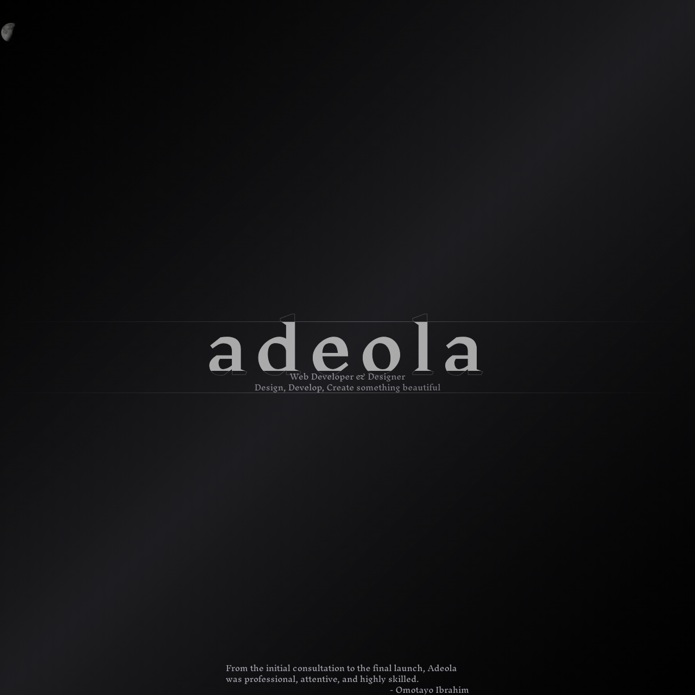
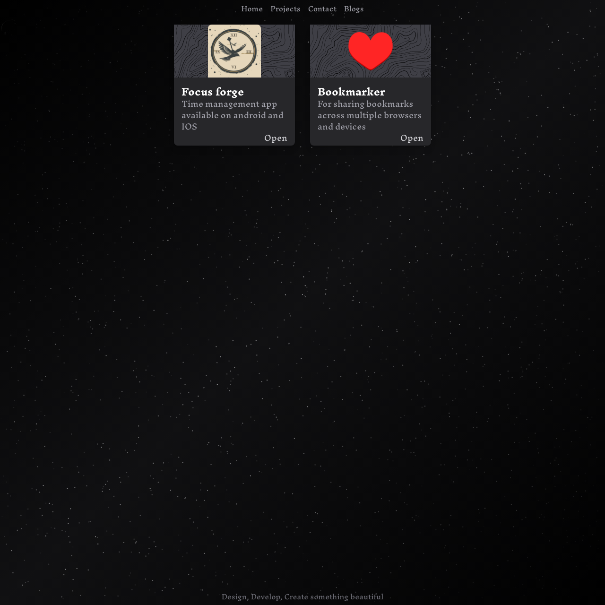
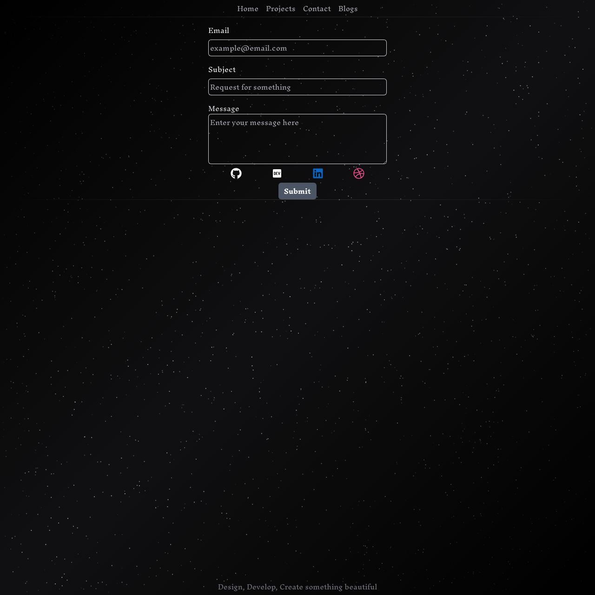
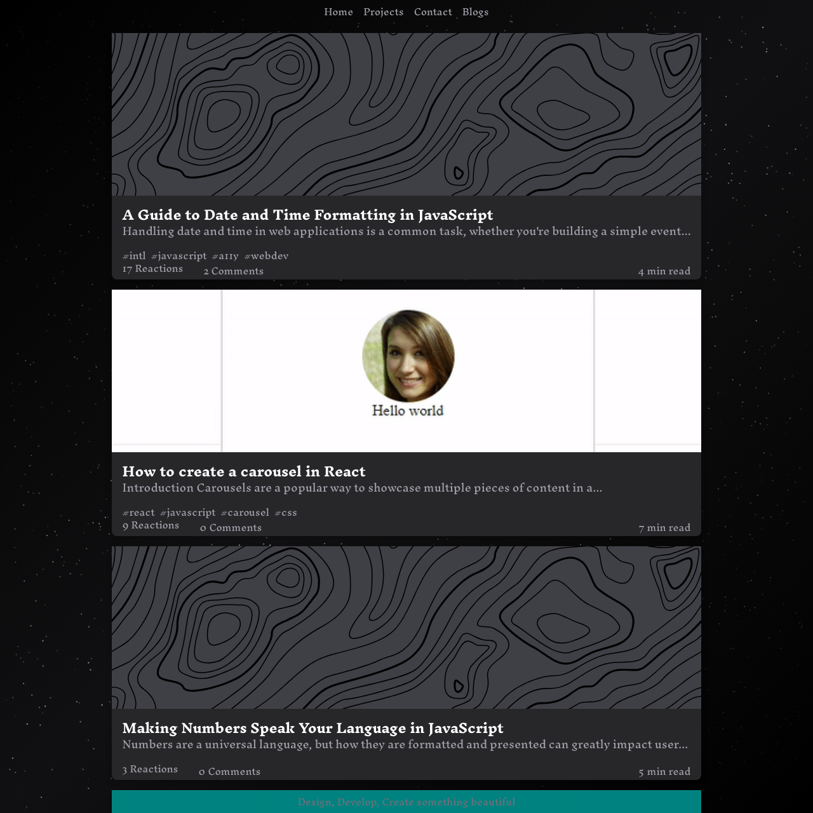
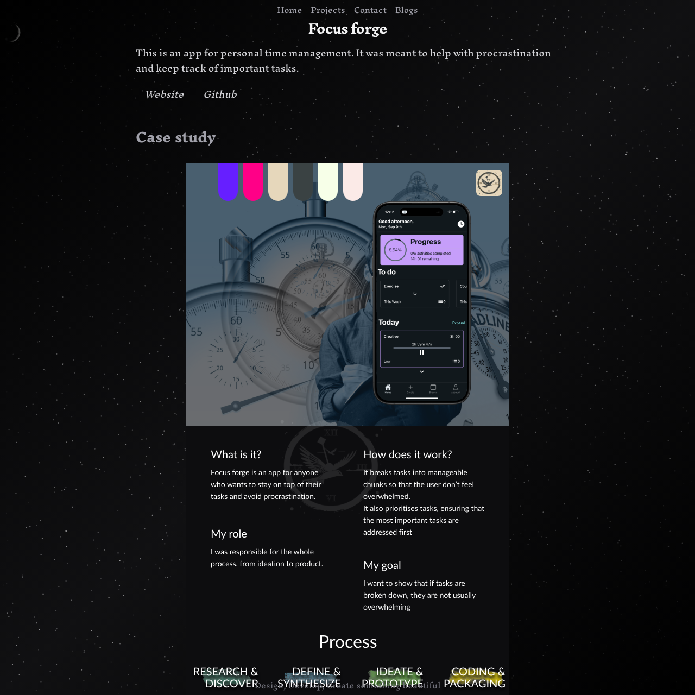
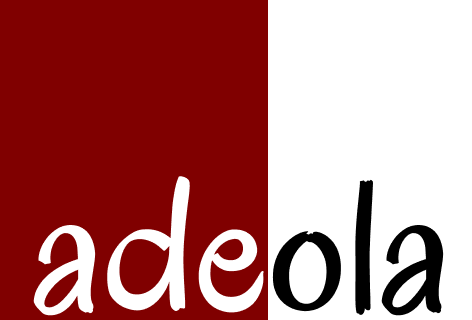

# Project Title

This is my personal website

## Badges


## Color Reference


## Demo

[Website](https://adeolaade.com/)

## Feedback

If you have any feedback, please reach out to me [here](https://adeolaade.com/contact)

## Installation

Install my-project with npm

```bash
  git clone https://github.com/Diorla/about-adeola
  cd about-adeola
```

## Support

For support, reach out to me [here](https://adeolaade.com/contact)

## Screenshots







## Run Locally

Clone the project

```bash
  git clone https://link-to-project
```

Install dependencies

```bash
  npm install
```

Start the server

```bash
  npm run dev
```




## License

[MIT](https://choosealicense.com/licenses/mit/)
